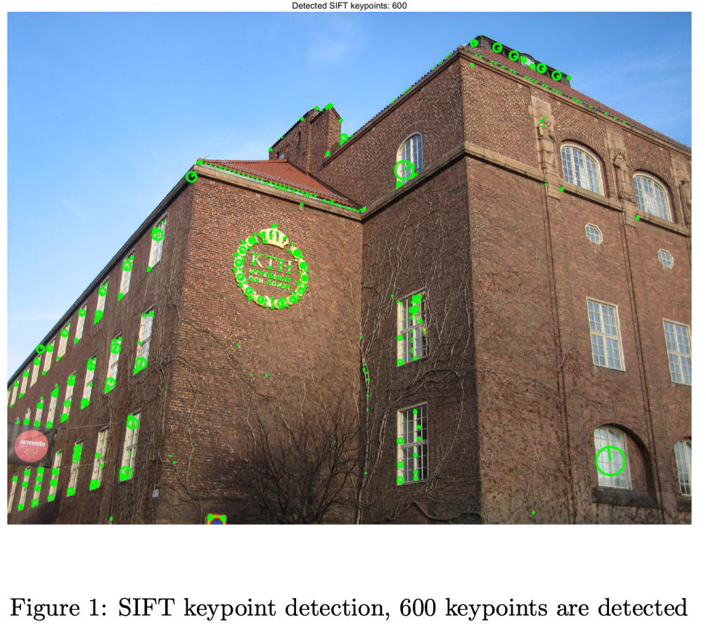
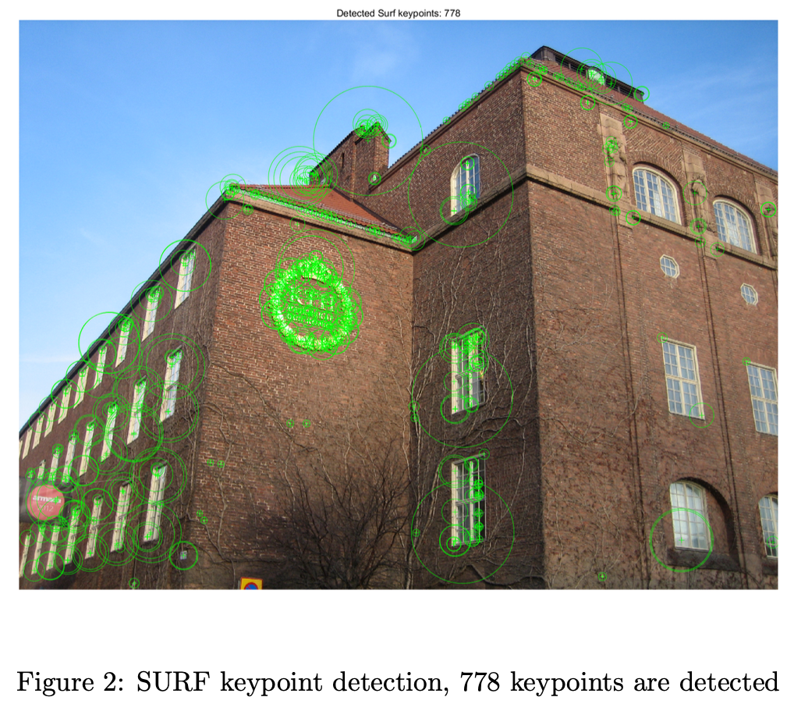

# Image Recognition and Classification

## Project 1

This project explores Image Features and Matching, a fundamental area in computer vision. It involves keypoint detection and feature matching using SIFT and SURF to assess their robustness against transformations such as rotation and scaling.

### Objectives

- Repeatability Analysis: Measure and compare the robustness of SIFT and SURF detectors against:

  - Rotation: Vary the angle from 0 to 360 degrees in increments of 15 degrees.
  - Scaling: Modify the image using scaling factors from 1.0 to 1.2^8.

- Image Feature Matching: Implement and analyze three feature matching algorithms:
  - Fixed Threshold Matching
  - Nearest Neighbor Matching
  - Nearest Neighbor Distance Ratio Matching

## Project 2

This project focuses on building a Visual Search System that recognizes building objects using SIFT descriptors and vocabulary trees. The visual search system retrieves the objects that are most similar to the query object by using TF-IDF (Term Frequency-Inverse Document Frequency) scoring for retrieval.

### Key Components

Image Feature Extraction

- Extract thousands of SIFT features from database images and query images.
- Index features according to the object number and report the average number of features extracted.

Vocabulary Tree Construction

- Hierarchical k-means Algorithm: Use the hierarchical k-means algorithm to build the vocabulary tree, with control over:
  - Branch Number (b): The number of branches each node has.
  - Tree Depth: The number of levels in the tree.
- Store necessary information in tree nodes, including data needed for querying by SIFT features and TF-IDF information in the leaf nodes.
- Function used: hi_kmeans(data, b, depth) to generate the vocabulary tree, where:
  - data holds SIFT features from the database objects.
  - b is the branch number for each level.
  - depth is the number of levels.

Querying

- Use the constructed vocabulary tree to send descriptors of each query object and rank the database objects based on TF-IDF scores.
- Test with 50 query objects and calculate the average recall rate:
  - Recall is object-based: It is either 0 or 1 per object.
- Experiment with different vocabulary tree configurations:
  - Settings: b = 4, depth = 3, b = 4, depth = 5, b = 5, depth = 7.
  - Report average top-1 and top-5 recall rates for each setting.
- Further experiments using the b = 5, depth = 7 tree:
  - Query with reduced numbers of query features (90%, 70%, or 50%).
  - Report the average top-1 and top-5 recall rates.

## Project 3

In this project, a three-layer convolutional neural network is constructed and trained for image recognition. Various parameters of both the network structure and the training process are then adjusted. Based on performance evaluations, the preferred configuration includes filters of sizes [64,128,256], convolution kernels of [7*7,5*5,3*3], Leaky ReLU activation, dropout, batch normalization, and no additional fully connected layer. Experiments also reveal that higher learning rates yield higher recall in the early stages of training, and data shuffling slightly increases the final recall rate.
